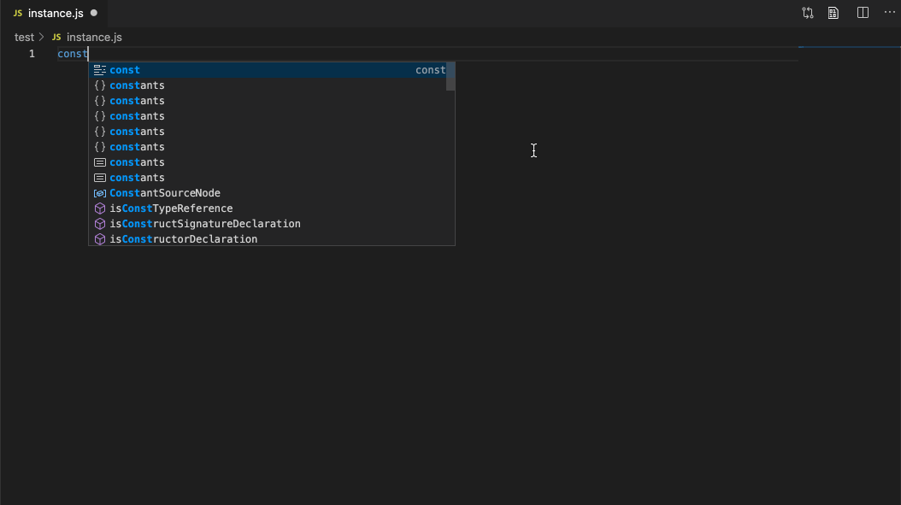

## 安装

```
pnpm add @woodenfish/aliyun-sdk-node
```

## 这个轱辘做了什么

- 从阿里云的 meta 接口中生成 api 的类型文件
  - `sync.ProductList.ts` 拉取一个阿里云所有产品的列表
  - `sync.ProductDetail.ts` 按列表拉取每个产品下的 api 列表与具体信息
  - `make.type.ts` 生成每个 api 的类型文件
- 调用阿里云 api 的时候有基本的提示
- 不必填写 `apiVersion` 与 `endpoint`
- 不用给每个业务创建一个 `api` 实例 (pop-core 需要给每个业务 new 一个实例出来)

## 为什么会有这个轱辘

0. 阿里云的文档搜索很糟糕
1. 我想有一定的参数提示（在 ts 中，必填参数未填，至少在 IDE 中会有提示了），返回值也能有参数说明
2. `apiVersion` 和 `endponit` 我希望有个默认值

## 还存在的问题

`@alicloud/openapi-client` 的参数未完全适配，并不是所有的接口都能调用成功

## 如何使用

参考 test 代码，其余的请 看 源 码 :)

## 示例


